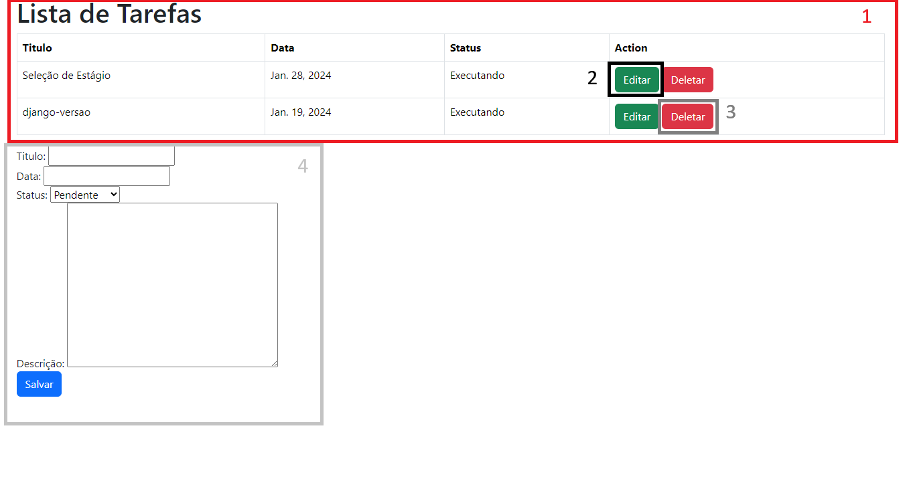
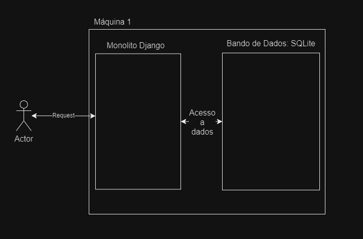

# Solução monolito
Esta solução é feita em monolito, usando o Framework Django, com a database padrão de SQLite. 

## Tecnologias
 - Python: 3.10.4
 - Django: 5.0.1

## Como inicializar
Dentro do repositorio django-monolito, é nessessario instalar as dependendencias:

```powershell
   pip install -r requirements.txt 
```
e por fim para iniciar o servidor:
```powershell
   python .\UnMEP\manage.py runserver 
```
O projeto sera executado no local host na porta 8000, portanto acessamos pelo link:
http://127.0.0.1:8000/tarefas/

## Como usar
Nesta primeira imagem temos pagina principal, onde todas as operações podem ser feitas.



Nesta pagina temos 4 elementos:

1 - Lista de tarefas cadastradas
2 - botão para editar tarefa
3 - botão para deletar tarefa
4 - formulario de adição/edição de tarefa


### Adição

Para adicionar uma tarefa é nescessario digitar o titulo, data e descrição desta tarefa, e selecionar o estados, por fim clicando em salvar

### Visualizar

As tarefas tem suas informações apresentadas na lista de tarefaz, com exceção da descrição, que para ser visualizada é nescessario clicar em editar e este sera carregado no campo de descrição

### Editar

Clicar no botão editar da tarefa desejada, que tera suas informações carregadas no formulario, onde podera ser feita as edições, para salvar clica-se no botão do formulario.

### Deletar

Para deletar uma tarefa clica-se no botão deletar do formulario.


## Comentarios
Nesta solução não existe uma API pronta para ser disponibilisada a um cliente ou integrada a um serviço diretamente, uma vez que o CSRF esta ativo, para este poder ser disponibilisado seria nescessario remover o CSRF destas rotas e trona as respsotas um json, uma vez que a resposta esta sendo uma pagina web.

Essa solução foi feita para mostra a possibilidade de um monolito que possa ser melhorado futuramente, apresentando assim uma solução nesta arquitetura.

Uma outra melhoria seria desacoplar o banco da maquina fazendo integração com um externo, uma vez que esta solução usa o SQLite criado automatico pelo DJango.

### Arquitetura:
Nesta aquitetura temos 1 maquina que contem todos os dados da aplicação, sendo recomendado em um cenario real o isolamento do banco de dados, com sua rede propria de acesso.



Aqui temos a ideia de ter uma rede internet para isolar o banco de dados, para ser acessado somente por maquinas predeterminadas, neste caso o BackEnd e em um cenario real uma maquina de administrador de banco de dados, e uma rede externa que seria a coneção usada do BackEnd e FrontEnd com a internet padrão, pela qual os usuarios acessariam.