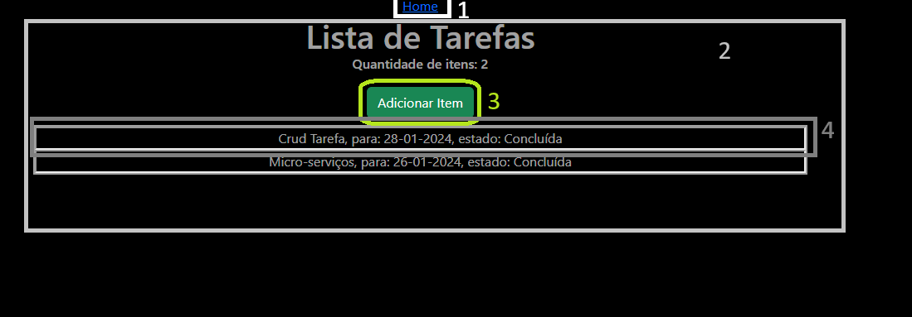
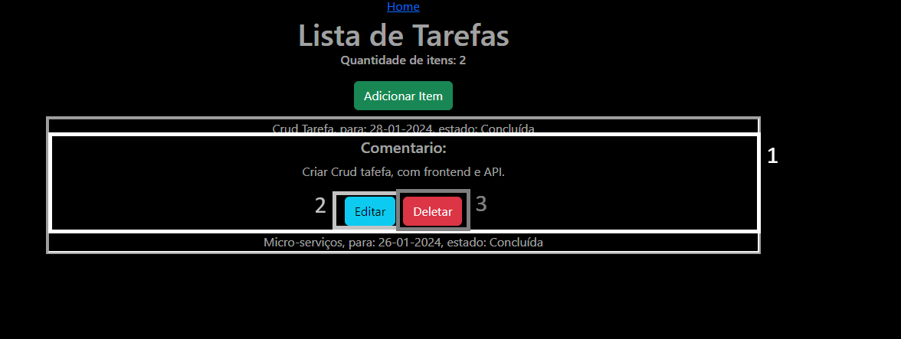
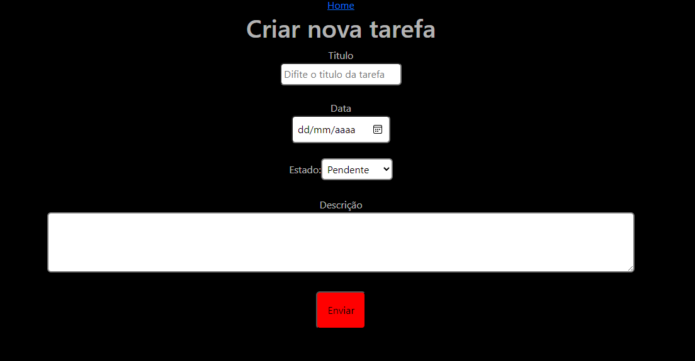
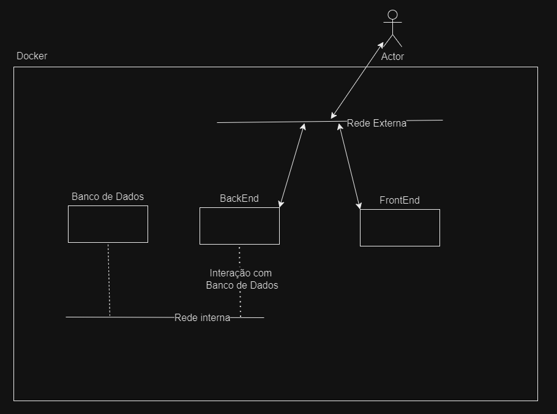

# Solução Microsserviço
Esta solução em micros serviço, para emular diversas máquinas foi usado o docker ( sendo criado um docker-compose para facilitar a criação das máquinas ), assim temos 2 projetos, Front End usando React e Backend com FantAPI, com um banco de dados MySQL.

## Tecnologias:
 - [Docker](https://www.docker.com/products/docker-desktop/): 4.26.1 
 - [NPM](https://nodejs.org/en/download): 8.13.1
 - [React](https://pt-br.legacy.reactjs.org/): 18.2.0 
 - [Python](https://www.python.org/downloads/): 3.10.4 
 - [FastAPI](https://fastapi.tiangolo.com/):0.109.0 
 - [SQLAlchemy](https://www.sqlalchemy.org/): 2.0.25

Aqui temos o docker para virtualizar as máquinas, NPM para gerenciar os pacotes do FrontEnd, que é um projeto react, FastAPI no Backend com SQLAlchemy de ORM e um banco de dados MySQL.

## Como inicializar

### Inicialização com Docker
Com o docker é necessário inicialmente criar a rede externa a primeira vez assim, executamos, primeiro:

```powershell
    docker network create tarefa
```
Para criar a rede externa que será usada pelo FrontEnd e Backend.

Então podemos subir as máquinas no docker, na pasta micro-serviços:
```powershell
    docker-compose up
```
Ao executar esse comando as máquinas serão iniciadas, porém ocorrerá um problema com o Backend, o qual tentará se conectar ao Banco de Dados, porém este demora um pouco mais a iniciar assim haverá falha na sua inicialização, sendo necessário reiniciá-lo. Note que este problema só acontece quando inicializamos o Banco de dados e o BackEnd “ao mesmo tempo".
Para isso, após o banco de dados estar funcional, executamos o seguinte comando em outro terminal:
```powershell
    docker restart backend
```

Então teremos o FrontEnd rodando em: http://localhost:3000/ e o BackEnd em:  http://localhost:8000/

### Inicialização sem Docker
Necessário ter python instalado na máquina que rodará o servidor BackEnd e NPM na máquina FrontEnd.

1- Banco de Dados

 Criamos o servidor MySQL, criamos uma DataBase chamada 'mysqldb' e iniciamos com o [script base](https://github.com/denielfer/Tarefa-Crud/tree/main/micro-servi%C3%A7os/init_db). Este cria na DataBase 'mysqldb' a tabela de tarefa e um usuário que será usado pelo Backend para manipular os dados.

2- BackEnd

Como esta solução foi criada para ser executada no Docker é necessário fazer um ajuste antes de executar o projeto BackEnd. No arquivo de [configuração](https://github.com/denielfer/Tarefa-Crud/blob/main/micro-servi%C3%A7os/backend/Tarefas/setting.py) é nescessario altera os valores terornados nas linhas 22 a 26 (como exemplificado no codigo abaixo), para os valores desejados ( usuario e senha criados no script de inicialização, que estao presentes no .env, o host e path da DataBase ).

```powershell
   ...
        return AnyUrl.build(
            scheme="mysql+pymysql",
            username={usuario},
            password={senha_de_usuario},
            host={link_para_mysql},
            path={db_usada},
   ...
```

Com estas alterações feitas na pasta 'backend':
```powershell
   pip install -r requirements.txt 
   uvicorn Tarefas.main:app --host 0.0.0.0 --port 8000 --log-config log.ini
```
Assim teremos o server sendo iniciado na porta 8000, no localhost e os logs sendo escritos em 'logfile.log'

3- FrontEnd

Na pasta 'frontend' executamos:
```powershell
    npm install
    npm start
```

Então teremos o FrontEnd rodando em: http://localhost:3000/ e o BackEnd em:  http://localhost:8000/

## Rotas:
### FrontEnd

 - '/' : Temos página inicial com a lista de tarefas carregadas do banco
 - '/tarefa/' : Página de Adição de tarefa
 - '/tarefa/{id}' : Pagina de Edição da tarefa com id={id}

### BackEnd

 -GET
  - '/tarefa/': Lista de todas as tarefas do banco, com todos os seus dados
  - '/tarefa/{id}': Todos os dados da tarefa com id={id}
  - '/tarefa/slice/{start}/{limit}': Lista de tarefas que começa em {start} e termina em {limit}, se existirem, das tarefas, ordenadas por criação.
    
 -DELETE
  - '/tarefa/{id}': Deleta tarefa com id={id}
    
 -POST
  - '/tarefa/': Cria uma nova Tarefa com dados passados no corpo da request.
    
 -PUT
  - '/tarefa/{id}/': Altera os dados da tarefa com id={id} para os passados no corpo da request.
 
## Como usar
Nesta primeira imagem temos a pagina inicial do FrontEnd.



Nesta página temos 4 elementos:

1 - Botão comum a todas as páginas para ir à página inicial

2 - Lista de tarefas cadastradas

3 - Botão para adicionar uma nova tarefa

4 - Cada item da lista de tarefas pode ser clicado para expandir e mostra a descrição

Assim ao clicarmos em um item temos:



Aqui temos a expansão de 1 card que traz:

1 - Card onde mostra o comentário
2 - Botão para editar tarefa
3 - Botão para deletar tarefa


### Adição

Na pagina inicial ao clicar o botão de Adicionar item, somos redirecionados à página de adição



A qual após preenchermos título e Data podemos enviar no botão enviar, que ficará verde ao preenchermos todos os dados. Caso não tenha sido preenchido Título ou Data o envio não sera efetuado, com os campos informando o dado ausente. Ao finalizarmos o envio, somos redirecionados à página inicial.

### Visualizar

Na pagina inicial temos todas as Tarefas cadastradas, para ver a descrição de uma delas, clicamos no seu item da lista.

### Editar

Para editar uma tarefa é aberto o card da tarefa desejada, na página inicial, e pressionar o botão de edição. Sendo redirecionado a uma página similar de criação, com os dados pré-carregados, então após editar os dados, clica-se em enviar, recebendo uma confirmação que a tarefa foi editada e sendo redirecionado à página inicial.

### Deletar

Para deletar uma tarefa, abrimos o card da tarefa desejada, na página inicial, e pressionamos o botão de deletar.

## Comentários

Esta solução já trás uma api que pode ser disponibilizada ou integrada a um serviço, porém sem fatores de segurança.

Através dessa mostramos como poderia ser uma solução em micros serviço, que poderia ser facilmente incorporada a um serviço já existente e modularizado para fácil escalabilidade.

### Arquitetura:
Nesta arquitetura temos o docker para simular a interação de 3 máquinas com 2 redes. Conforme:



Aqui temos a ideia de ter uma rede internet para isolar o banco de dados, para ser acessado somente por máquinas predeterminadas, neste caso o BackEnd e em um cenário real uma máquina de administrador de banco de dados, e uma rede externa que seria a conexão usada do BackEnd e FrontEnd com a internet padrão, pela qual os usuários acessarem.
